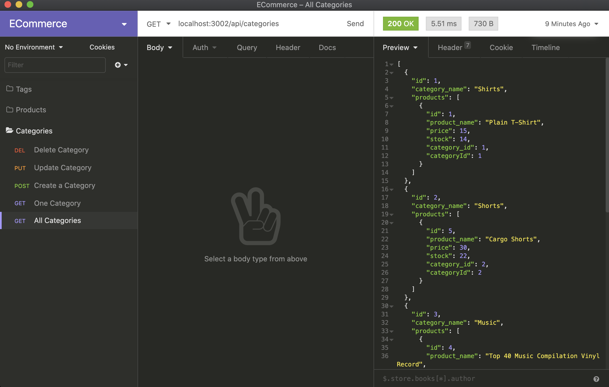

# ECommerce Back End 

   
  This back end application allows user to communicate with the database and manage its contents using Object Relational Mapping toolkit. 

   

   [Github repo](https://github.com/Amal31497/ECommerce)

   

  ## Table of Contents 
 
  ##### * [Technologies used](#Technologies)
  ##### * [Usage walkthrough](#Walkthrough)
  ##### * [Installation](#Installation)
  ##### * [Credits](#Credits)
  ##### * [License](#License)
  ##### * [Contact Info](#Contact)

  ## Technologies:
   _*Javascript,Node.js,Others*_

  ## Walkthrough:
  #### Video:
  Please follow this *[link](https://youtu.be/keoOH4314Xo)* to watch the walkthrough video.

  #### Screenshots:
    

  ## Installation:
  Run the following commands in your integrated terminal to initalize the application:

    1. git clone [Repository link you can find under "code" button] (To get the code from a repo)

    2. npm install

    3. npm run seed

    3. npm run watch

    4. Run all insomnia api commands I showed in the walkthrough video

    5. Get the output
  
  ## Credits:
  [https://sequelize.org/](https://sequelize.org/)
  [https://www.w3schools.com/](https://www.w3schools.com/)
  

  ## License: 

  ##### Copyright: Amal Janabayev

  ##### 

  ##### [Licence Link](https://opensource.org/licenses/BSD-3-Clause)

  ## Contact: 

  ##### amalj2426@gmail.com
